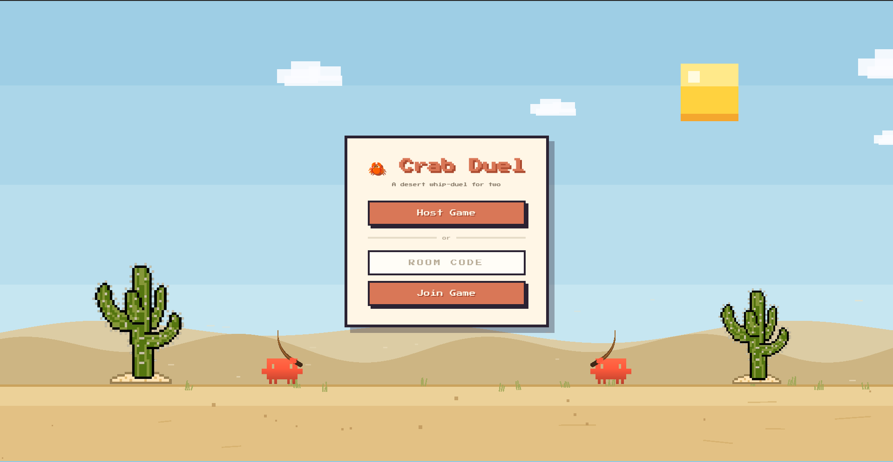

# 🦀 Crab Duel

A real-time, two-player **desert whip-duel** that runs entirely in the browser. Two crabs face off across a pixel-art dune, cracking leather whips at each other until one runs out of HP. There's no game server — players connect **directly to each other** over WebRTC using a short room code.



## Highlights

- **Peer-to-peer multiplayer, no backend.** Match two players with a 4-character room code over WebRTC ([PeerJS](https://peerjs.com/)). The host claims the code as its peer ID; the joiner dials it. Once connected, all game traffic flows directly between the two browsers.
- **Authoritative-per-crab netcode.** Each client simulates *its own* crab and broadcasts that state every frame; the opponent's crab just renders the last synced snapshot. Hits are reported, not imposed — when my whip connects I send a `hit` message and *you* subtract your own HP. This keeps the two clients from fighting over ownership of any single value.
- **Hand-rolled rendering with PixiJS.** Sky gradient, drifting clouds, a pixel sun, parallax dunes, scattered cacti, blowing dust and a rolling tumbleweed — all drawn procedurally and composited in a fixed 1280×720 "design space" that scales to fit any window (with overscan so letterbox bars still read as sky and sand).
- **Frame-precise combat.** The whip is a directional crack with distinct wind-up → active → recover → cooldown windows, knockback that decays over time, and a hit-flash. Tuning all lives in one [`config.ts`](./src/config.ts).
- **Procedural sprite animation.** The crab walk cycle is generated from a single `crab.png` at load time rather than shipped as a sprite sheet.

## How to play

1. Run the app (see below) and open it in two browsers — two tabs, two machines, doesn't matter.
2. One player clicks **Host Game** and reads out the 4-character room code.
3. The other player types the code and clicks **Join Game**.
4. The duel begins the moment both peers connect.

**Controls**

| Key | Action |
| --- | --- |
| `A` / `D` | Walk left / right |
| `Space` | Crack the whip |

First crab to drain the other's HP wins (~11 clean hits).

## Tech stack

- **[TypeScript](https://www.typescriptlang.org/)** — strict, no framework
- **[PixiJS 8](https://pixijs.com/)** — WebGL 2D rendering
- **[PeerJS](https://peerjs.com/)** — WebRTC data channels for P2P networking
- **[Vite](https://vite.dev/)** — dev server and build
- **ESLint + Prettier** — linting and formatting

## Running locally

```bash
npm install
npm run dev      # starts Vite on http://localhost:8080 and opens it
```

Other scripts:

```bash
npm run build    # lint, type-check, and produce a production bundle
npm run lint     # ESLint
```

To play across two machines, both need network reachability for WebRTC; PeerJS uses public STUN servers by default.

## Project layout

```
src/
  main.ts          # boot PixiJS, build the scene, run the game loop
  Net.ts           # WebRTC host/join + send/receive over PeerJS
  lobby.ts         # room-code menu, resolves to a connected Net
  Crab.ts          # player character: movement, whip, HP, knockback
  crabAnimation.ts # builds the walk-cycle frames from crab.png
  config.ts        # all tunable constants and the color palette
  Input.ts         # keyboard state
  Hud.ts           # health bars
  World.ts Sky.ts Sun.ts Clouds.ts Dust.ts Cactus.ts Tumbleweed.ts
                   # procedural desert scenery
```

## Architecture notes

The game loop in [`main.ts`](./src/main.ts) is the heart of it. The whole scene is built up front and rendered *behind* the lobby, so the menu sits inside the real game world rather than on a separate screen. Until both players connect, the loop just animates ambient scenery. Once connected, it:

1. reads local input and drives **my** crab,
2. broadcasts my crab's state to the opponent every frame,
3. renders the opponent's crab from their last synced state, and
4. on a local whip-overlap, tells the opponent to take damage.

Splitting authority this way — *you own your crab, I own mine* — keeps the netcode simple enough to fit in a single file while staying responsive, since your own crab never waits on the network to move.
